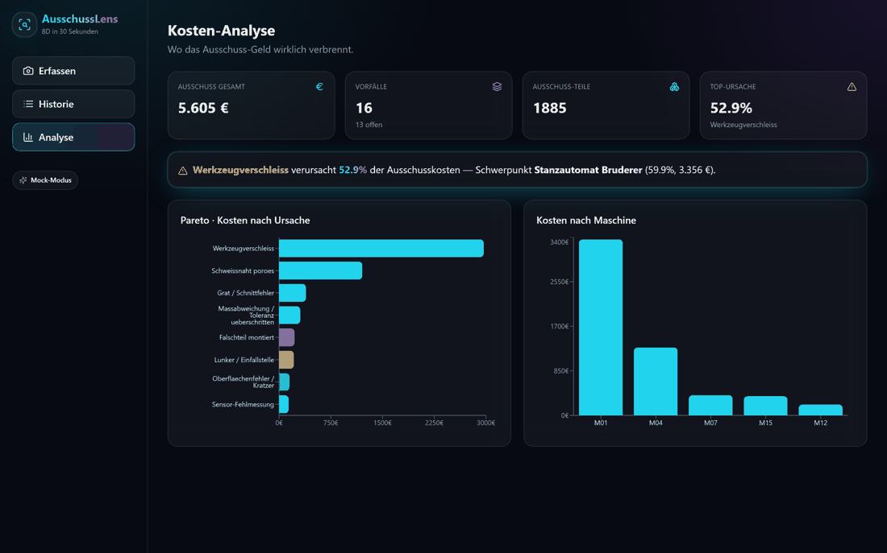
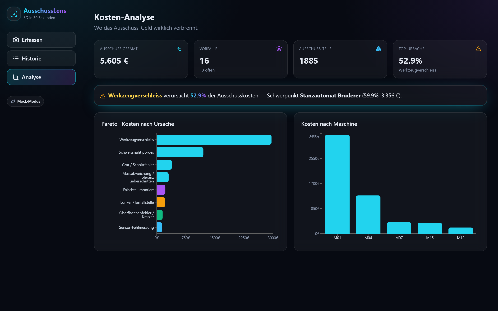
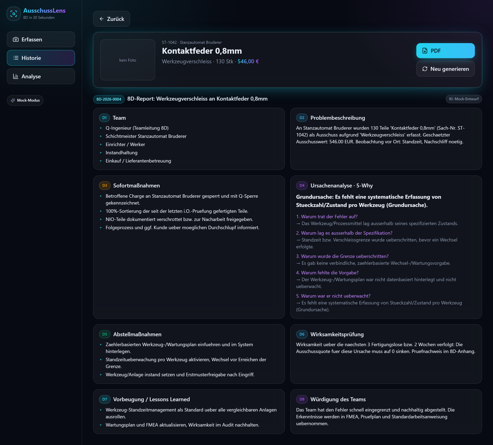
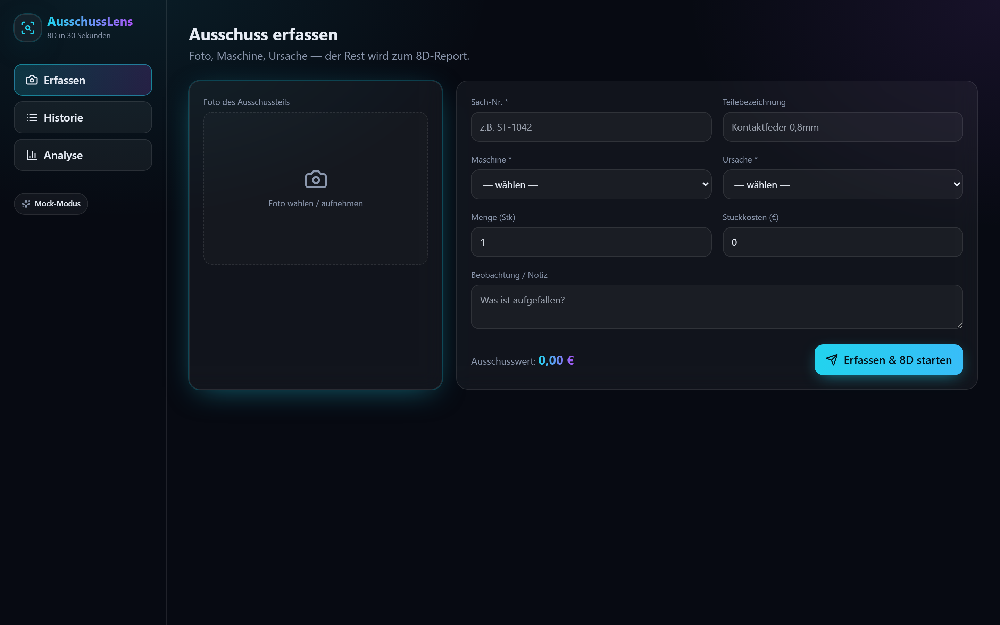

<div align="center">

# 🔍 AusschussLens

**Foto vom Ausschussteil rein — fertiger 8D-Report mit 5-Why raus. In 30 Sekunden statt 3 Stunden.**

*Snap a scrap part, tap the cause — get a complete 8D / 5-Why quality report in 30 seconds.*


</div>

<div align="center">



_Pareto-Analyse → Ausschussteil öffnen → 8D-Report mit einem Klick._

</div>

---

## Warum es das gibt

13 Jahre Produktion. Jedes Mal dasselbe bei einer Reklamation: Stundenlang einen **8D-Report**
zusammenstückeln — Problembeschreibung, 5-Why, Sofort- und Abstellmaßnahmen, alles aus dem Gedächtnis
rekonstruiert. Und wenn der **IATF-Audit** kommt, sucht jeder den lückenlosen Nachweis.

**AusschussLens** dreht das um: Der Werker fotografiert das Ausschussteil am Tablet, tippt die Ursache an —
die KI schreibt den vollständigen **D1–D8-Report inkl. 5-Why** und legt ihn revisionssicher als PDF ab.
Gleichzeitig zeigt das Live-**Pareto**, welche Maschine und welche Ursache das meiste Geld verbrennt.

Trifft beim Chef zwei Nerven gleichzeitig: **Fehlerkosten** und **Audit-Sicherheit**.

## ✨ Features

- 📸 **2-Klick-Erfassung am Tablet** — Foto, Maschine, Ursache (6M-Katalog), Menge, Kosten
- 🧠 **KI-8D-Generator** — vollständiger D1–D8-Report mit **5-Why**-Kette in Sekunden
- 🧾 **Audit-taugliches PDF** — revisionssicheres 8D-Dokument auf Knopfdruck
- 📊 **Pareto & Kosten-Cockpit** — „diese Ursache = X % der Ausschusskosten an Maschine Y"
- 🗂️ **Lückenlose Historie** — auf einen Klick für IATF 16949 / VDA
- 🔌 **Local-first** — läuft komplett ohne Cloud und **ohne API-Key** (deterministischer Mock-8D).
  Mit `ANTHROPIC_API_KEY` schreibt **Claude** echte Reports und analysiert das Teil-Foto mit.

## 📸 Screenshots

**Kosten-Analyse** — der Pareto zeigt sofort, welche Ursache an welcher Maschine das Geld verbrennt:


**8D-Report** — vollständiger D1–D8 inkl. 5-Why, generiert in Sekunden, exportierbar als PDF:


**Erfassen** — Foto, Maschine, Ursache am Tablet:


## 🚀 Quickstart

### Variante A — Docker (alles in einem)
```bash
docker compose up --build
# Frontend:  http://localhost:8080
```

### Variante B — lokal (Dev)
```bash
# 1) Backend
cd backend
py -3.12 -m venv .venv && .venv\Scripts\activate     # Windows
pip install -r requirements-dev.txt
uvicorn app.main:app --reload                         # http://localhost:8000

# 2) Frontend (zweites Terminal)
cd frontend
npm install
npm run dev                                           # http://localhost:5173
```

Die App startet mit realistischen **Seed-Daten** (5 Maschinen, 10 Ursachen, 15 Vorfälle) — Pareto und
Historie sind sofort gefüllt.

### Echte KI aktivieren (optional)
```bash
# backend/.env
ANTHROPIC_API_KEY=sk-ant-...
ANTHROPIC_MODEL=claude-sonnet-4-6
```
Ohne Key bleibt alles voll funktionsfähig — der 8D-Report wird dann aus einem fachlich sauberen
Template (inkl. ursachenspezifischer 5-Why-Ketten) erzeugt.

## 🧩 So entsteht der 8D

```
Foto + Ursache + Kosten
        │
        ▼
  Kontext (Teil, Maschine, 6M-Kategorie, Menge, Wert, Notiz)
        │
        ▼
  LLM / Mock  ──►  strukturiertes JSON  (D1…D8 + 5-Why)
        │
        ├──►  Web-Ansicht (Glow-Glass Karten)
        └──►  PDF (audit-tauglich, xhtml2pdf)
```

Die Ursachenanalyse folgt der **5-Why**-Methode und ist nach den **6M** (Maschine, Material, Mensch,
Methode, Messung, Mitwelt) kategorisiert — jede Kategorie erzeugt eine plausible, fachlich passende
Why-Kette bis zur Grundursache.

## 🛠️ Tech-Stack

| Schicht   | Technologie |
|-----------|-------------|
| Backend   | FastAPI · SQLite (raw, ohne ORM) · xhtml2pdf · Anthropic SDK |
| Frontend  | React 18 · Vite · TypeScript · Tailwind · Recharts · lucide-react |
| KI        | Claude (Vision + Text), austauschbar; Mock-Provider als Fallback |
| Deployment| Docker Compose (nginx + uvicorn) |
| Tests     | pytest (End-to-End über den kompletten Demopfad) |

## 📁 Struktur
```
AusschussLens/
├── backend/         FastAPI-App, 8D-Engine, PDF, Tests
│   └── app/
│       ├── routers/      events · reports · analytics · master
│       └── services/     llm · eightd · pdf · prompts
├── frontend/        React + Vite (Erfassen · Historie · Report · Analyse)
└── docker-compose.yml
```

## 🗺️ Roadmap

- [ ] Lieferanten-Portal: 8D automatisch an den Kunden senden
- [ ] Trend über Zeit + Maßnahmen-Tracking (offen/erledigt/wirksam)
- [ ] Foto-Heatmap der Fehlerstellen
- [ ] Anbindung an **StillstandRadar** (OEE) → gemeinsame **Shopfloor-Suite**

## 📜 Lizenz

MIT © 2026 Maurice Putinas

---
<div align="center"><sub>Gebaut aus 13 Jahren Hallenboden-Erfahrung. Kein Excel wurde bei der Produktion dieses Tools verschont.</sub></div>
